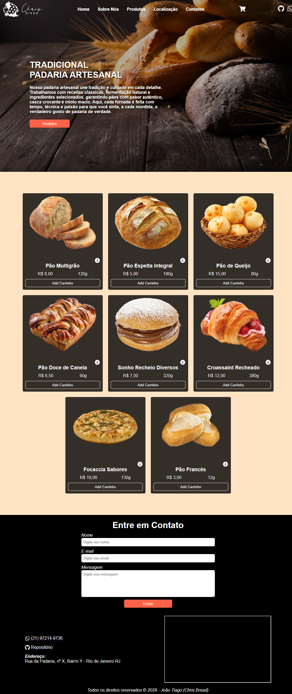

<h1>🍞 Chris Bread</h1>

Interface de uma padaria moderna focada em apresentação de produtos e experiência do usuário.

Este projeto foi inicialmente desenvolvido com HTML, CSS e JavaScript puro, e posteriormente reestruturado utilizando React com TypeScript, visando escalabilidade, reutilização de código e melhores práticas de desenvolvimento.

<h2>📸 Preview</h2>

- 🚀 Tecnologias
- React
- TypeScript
- CSS
- Vite

<h2>✨ Funcionalidades</h2>

- 📦 Listagem de produtos
- 🧾 Página de detalhe do produto
- 🛒 Carrinho de compras funcional
- 📩 Seção de contato
- 🔄 Componentização e reutilização de código

O projeto passou por uma refatoração completa, saindo de uma estrutura estática para uma arquitetura moderna baseada em componentes.

<h2>Principais melhorias:</h2>

- 🔧 Refatoração dos cards de produtos
- 🧾 Implementação página de detalhe do produto
- 🛒 Implementação do carrinho de compras
- 📩 Criação da seção de contato
- 📁 Melhor organização de pastas e componentes
- ⚙️ Tipagem com TypeScript

<h2>▶️ Como rodar o projeto</h2>

- npm install
- npm run dev

<h2>🎯 Objetivo</h2>

Este projeto faz parte da minha evolução como desenvolvedor, com foco em:

- Construção de interfaces modernas
- Boas práticas com React
- Organização e escalabilidade de código
- Tipagem segura com TypeScript
- Gerenciamento de estado global com Context API

<h2>📌 Status do Projeto</h2>

Últimas atualizações:

- Refatoração dos cards de produtos
- Página de detalhe dos produtos
- Carrinho de compras funcional
- Seção de contato implementada

📅 18/04/2026
