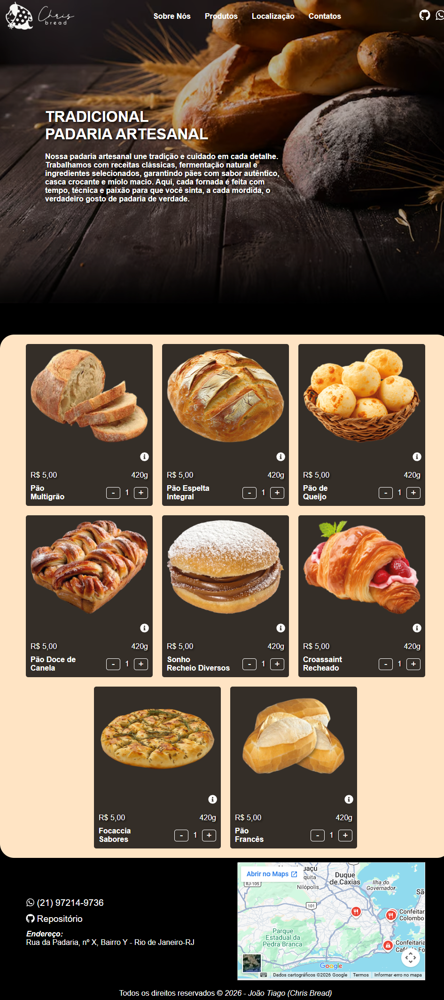

🍞 Chris Bread

Interface de um site para padaria desenvolvida com foco em apresentação de produtos e experiência do usuário.

Este projeto começou com uma estrutura simples em HTML, CSS e JavaScript, mas foi totalmente reestruturado utilizando React com TypeScript, buscando um código mais organizado, reutilizável e preparado para evolução.

📸 Preview do projeto

<p align="center">
  
</p>

💻 Tecnologias
React
TypeScript
CSS
Vite
🔄 Sobre a evolução do projeto

A primeira versão foi construída de forma estática.
Com a evolução, surgiu a necessidade de melhorar a organização e escalabilidade, então foi feita a migração completa para React com TypeScript.

Essa mudança permitiu:

Separação por componentes
Reutilização de código
Melhor controle de estados
Estrutura mais próxima de projetos reais do mercado
🚧 Em desenvolvimento

O projeto ainda não está finalizado. Próximos passos:

```
🛒 Implementar carrinho de compras
📱 Ajustar responsividade (mobile e tablet)
🎨 Melhorar alguns detalhes de interface
🌐 Deploy
```

O projeto ainda não possui deploy.

A ideia é publicar assim que as funcionalidades principais (como o carrinho e responsividade) estiverem concluídas.
```
▶️ Como rodar localmente
npm install
npm run dev
🎯 Objetivo
```

Esse projeto faz parte do meu processo de evolução como desenvolvedor, com foco em:
```
Construção de interfaces modernas
Boas práticas com React
Organização e escalabilidade de código
📌 Observação
```

Esse projeto continuará sendo atualizado conforme novas funcionalidades forem sendo implementadas.